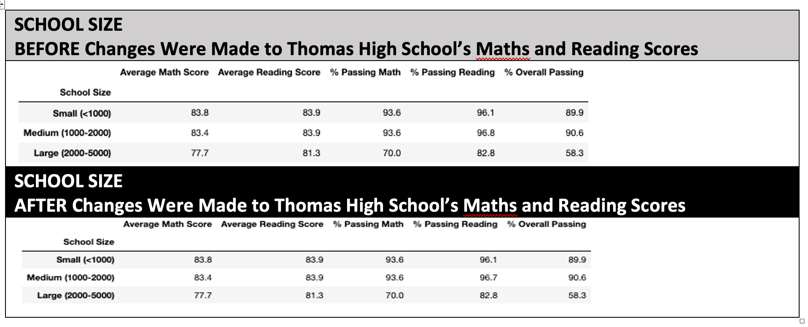

# School_District_Analysis

Apply pandas and NumPy to be able to come up with a more accurate data that can be used for the school district's analysis of 10th-12th grader's reading and math scores.

# Overview of the School District Analysis
The first objective is to be able to replace the math and reading scores for one of the high schools while keeping the rest of the data intact. Before repeating the school district analysis, we took out all the scores for that grade level in that high school so it doesnt affect the overall numbers of the school district.

# Results

## Effects to the District Summary
There was very minimal change after the corrections were made with the Maths and Reading scores of Thomas High School.
* The was a 0.1 decrease in the average Maths score, from 79.0 to 78.9.
* The passing Maths score also decreased from 75.0% tp 73.9%.
* The overall passing score also decreased from 65.2% to 64.1%

## Effects to the School Summary

The school summary was slightly affected by the correction made:
* There was a decrease in the average Maths score, from 83.41  to 83.35, as well as  the %Passing Maths score from 93.27% to 93.18%
* There was a slight increase in the average Reading score, from 83.84 to 83.89
* The % Overall Passing decreased from 90.94% to 90.63%, a 0.31% decrease.

## Effects to Thomas High School's Performance Relative to the Other Schools After Replacing Math and Reading Scores

* Replacing the ninth graders’ math and reading scores, did not affect Thomas High School’s performance relative to the other schools. I personally think that removing the scores was a good practice, specifically if another analysis or comparison was to be made in terms of per grade level, it would have been unfair for the rest of the schools in the district. The reason as to why the scores might have been manipulated is because the scores of these students might bring the Thomas High School's overall scores lower. 

## Effects of Replacing the Ninth-Grade Scores  

* Math and Reading Scores by Grade
The Math and Reading scores for the 9th graders who attended Thomas High school now shows Nan, instead of a numeric value, after the ninth grade scores in these two school subjects were replaced.

* Scores by School Spending
Since the Ninth-graders were not included in the computation or statistics, the values in terms of school spending are almost the same, except for the $630-644 range where the % Passing Reading and the % Overall Passing both dropped by 0.1% to respectively 84.3% and 62.8%.

* Scores by School Size
The overall passing percentage were not altered, regardless of the school's size, however there was a decrease on the Medium size school range where the % Passing Reading dropped from 96.8% to 96.7%.

* Scores by school type
The scores by school type did not change at all.

# Results

We were not able to observe major changes to the school district analysis after corrections were made in the Maths and Reading scores of the Thomas HIgh School's Ninth graders. The original scores for these students were changed and currently display NaN values.

The district summary, the school summary for Thomas High School, the scores by school spending and the scores by school size summaries had minimal alterations after the changes were made for Thomas High School

